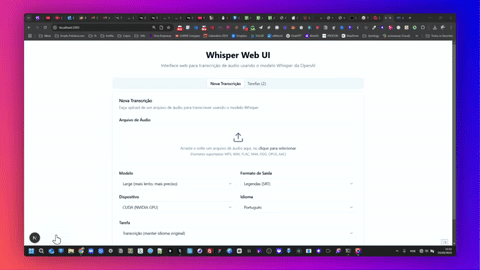

# Whisper Web UI

Web interface for audio transcription using OpenAI's Whisper model.

*Leia isto em [Português](./README.md)*

## Demo

See below a demonstration of the Whisper Web UI interface:



The interface allows you to upload audio files, select the desired Whisper model, and configure various transcription options intuitively.

### Demo Video

For a more detailed demonstration of how the application works, watch the video below:

<video src="./media/whisper-web-ui-otm.mp4" controls title="Whisper Web UI Demo" width="640"></video>

> **Note:** The video tag above may not work on all README viewing platforms (such as GitHub, GitLab, etc.). If the video is not visible, you can access it through the link below.

You can also download the demo video directly:

[Download demo video](https://github.com/felvieira/whisper-web-ui/raw/main/media/whisper-web-ui-otm.mp4)

## About the Project

This project provides a user-friendly web interface for [Whisper](https://github.com/openai/whisper), an automatic speech recognition (ASR) model developed by OpenAI. With this interface, you can:

- Upload audio files for transcription
- Choose between different Whisper models (tiny, base, small, medium, large)
- Select the output format (text, SRT, VTT, JSON)
- Use CPU or GPU (CUDA) for processing
- Track the progress of transcriptions
- Download the results

## Requirements

- Python 3.8 or higher
- Node.js 14 or higher
- npm
- FFmpeg (for audio processing)
- NVIDIA GPU with CUDA (optional, for faster processing)

## Installation

### Automatic Installation

To facilitate installation, use the setup script:

```bash
# Clone the repository
git clone https://github.com/your-username/whisper-web-ui.git
cd whisper-web-ui

# Run the installation script
python setup.py
```

### Manual Installation

If you prefer to install manually:

1. Clone the repository:
   ```bash
   git clone https://github.com/your-username/whisper-web-ui.git
   cd whisper-web-ui
   ```

2. Create and activate a Python virtual environment:
   ```bash
   # In the parent directory
   cd ..
   python -m venv whisper_env
   
   # Windows
   whisper_env\Scripts\activate
   
   # Linux/Mac
   source whisper_env/bin/activate
   
   # Return to the project directory
   cd whisper-web-ui
   ```

3. Install backend dependencies:
   ```bash
   pip install -r requirements.txt
   ```

4. Install frontend dependencies:
   ```bash
   npm install
   ```

5. Download Whisper models:
   ```bash
   python download_models.py
   ```

## Usage

### Start the Backend

```bash
# Activate the virtual environment (if not already activated)
# Windows
..\whisper_env\Scripts\activate

# Linux/Mac
source ../whisper_env/bin/activate

# Start the backend server
python backend.py
```

The backend server will be available at `http://localhost:5000`.

### Start the Frontend

In another terminal:

```bash
npm run dev
```

The frontend will be available at `http://localhost:3000`.

## Features

### Audio Transcription

1. Access the web interface at `http://localhost:3000`
2. Upload an audio file
3. Select the desired options:
   - **Model**: Choose between tiny (faster, less accurate) to large (slower, more accurate)
   - **Output Format**: TXT, SRT, VTT, or JSON
   - **Device**: CPU or CUDA (GPU)
   - **Language**: Automatic detection or select a specific language
   - **Task**: Transcription (keep original language) or Translation (to English)
4. Click on "Transcribe Audio"
5. Track progress in the "Tasks" tab
6. Download the result when the transcription is complete

### Task Management

- **Task List**: View all transcription tasks
- **Status**: Track the progress of each task
- **Download**: Download the results of completed transcriptions
- **Try Again**: Resubmit failed tasks

## Available Models

| Model  | Parameters | Size   | RAM Requirements | Relative Time | Accuracy  |
|--------|------------|--------|------------------|---------------|-----------|
| tiny   | 39 M       | 75 MB  | ~1 GB            | ~32x          | Low       |
| base   | 74 M       | 142 MB | ~1 GB            | ~16x          | Medium    |
| small  | 244 M      | 466 MB | ~2 GB            | ~6x           | Good      |
| medium | 769 M      | 1.5 GB | ~5 GB            | ~2x           | Very good |
| large  | 1550 M     | 3.0 GB | ~10 GB           | 1x            | Excellent |

## Troubleshooting

### Error "No module named 'tiktoken'"

Install the tiktoken library:

```bash
pip install tiktoken
```

### Error loading large models

Larger models (medium, large) require more RAM. Make sure your system has enough memory.

### CUDA problems

Check if CUDA is installed correctly:

```bash
python -c "import torch; print(torch.cuda.is_available())"
```

If it returns `False`, check your CUDA installation and NVIDIA drivers.

## License

This project is licensed under the MIT License - see the LICENSE file for details.

## Acknowledgments

- [OpenAI Whisper](https://github.com/openai/whisper) for the speech recognition model
- [Next.js](https://nextjs.org/) for the frontend framework
- [Flask](https://flask.palletsprojects.com/) for the backend framework 